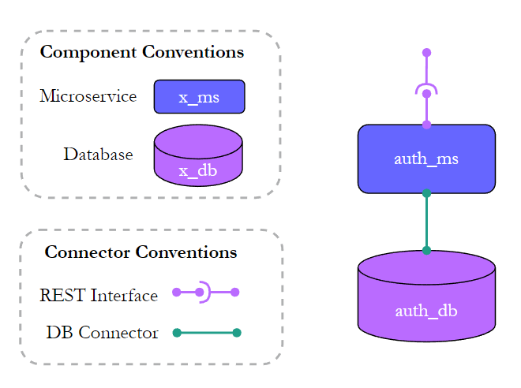
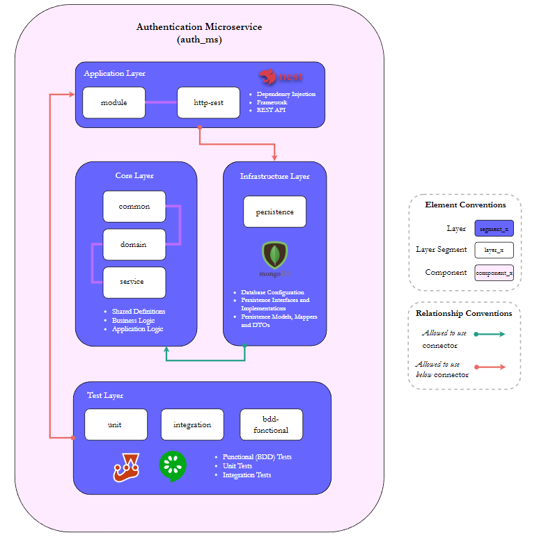
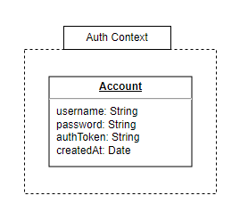

# Authentication

## Description:

Exposes the REST-HTTP authentication API of the system.

## Technologies:

- *NodeJS* as the **runtime environment**
- *NestJS* as the backend **web framework**
- *Swagger* to **document** the API
- *MongoDB* for **persistence**
- *Jest* for **testing**
- *Gherkin* and *Cucumber* for **BDD testing**
- *Supertest* for **integration testing**

## Components

  
Figure 1. Authentication Components

- *auth_ms*: Stateless component which exposes a REST API
- *auth_db*: Stateful component deployed in a MongoDB database

## Logical Layers:

  
Figure 2. Authentication Microservice Logical Layers

## Data Model:

  
Figure 3. Authentication Data Model
